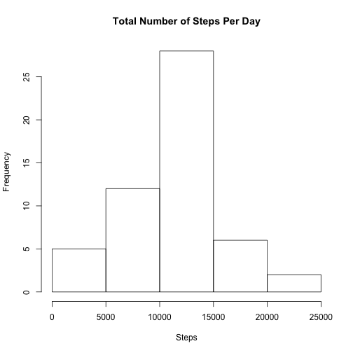
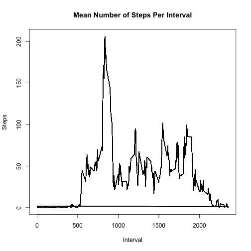
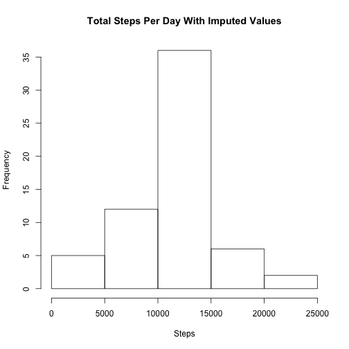
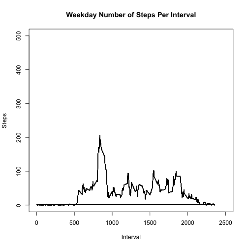
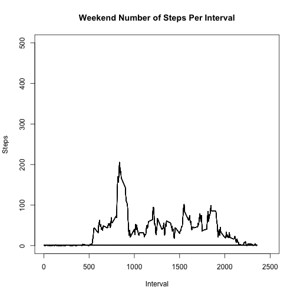

Reproducible Research Project 1
================================

The following assignment deals with activity data from personal monitoring devices, collected at 5 minute intervals daily, over the course of two months. The first step in analyzing this data will be reading in the file:


```r
setwd("/Users/maxsergeyev/Downloads")
active <- read.csv("activity.csv")
active1 <- active[complete.cases(active),]
```

**Question 1**

  The following code will calculate the total number of steps per day using a tapply command:
  

```r
x <- tapply(active1$steps, active1$date, sum)
daysum <- x[!is.na(x)]
```
A histogram of the total number of steps taken per day follows:


```r
hist(daysum, xlab = "Steps", main = "Total Number of Steps Per Day")
```


  
  As well as the mean number of steps taken per day:
  

```r
mean(daysum)
```

```
## [1] 10766.19
```

And the median number of steps taken per day:


```r
median(daysum)
```

```
## [1] 10765
```

**Question 2**

  We can also analyze the daily activity patterns over the course of the various 5 minute intervals. The following plot illustrates the changes in mean number of steps taken over the measured intervals: 
  

```r
active1$intmean <- tapply(active1$steps, active1$interval, mean)
plot(active1$interval, active1$intmean, type = "l", xlab = "Interval", ylab = "Steps", main = "Mean Number of Steps Per Interval")
```


 
  The interval that has the largest number of steps on average is interval 835.
  

```r
active1[active1$intmean ==  max(active1$intmean), ]
```

```
##       steps       date interval  intmean
## 392       0 2012-10-02      835 206.1698
## 680      19 2012-10-03      835 206.1698
## 968     423 2012-10-04      835 206.1698
## 1256    470 2012-10-05      835 206.1698
## 1544    225 2012-10-06      835 206.1698
## 1832      0 2012-10-07      835 206.1698
## 2408    635 2012-10-09      835 206.1698
## 2696      0 2012-10-10      835 206.1698
## 2984    747 2012-10-11      835 206.1698
## 3272    742 2012-10-12      835 206.1698
## 3560     67 2012-10-13      835 206.1698
## 3848     52 2012-10-14      835 206.1698
## 4136    786 2012-10-15      835 206.1698
## 4424    743 2012-10-16      835 206.1698
## 4712    720 2012-10-17      835 206.1698
## 5000    757 2012-10-18      835 206.1698
## 5288      0 2012-10-19      835 206.1698
## 5576      0 2012-10-20      835 206.1698
## 5864     14 2012-10-21      835 206.1698
## 6152     25 2012-10-22      835 206.1698
## 6440      0 2012-10-23      835 206.1698
## 6728      0 2012-10-24      835 206.1698
## 7016      0 2012-10-25      835 206.1698
## 7304     34 2012-10-26      835 206.1698
## 7592    544 2012-10-27      835 206.1698
## 7880    489 2012-10-28      835 206.1698
## 8168     56 2012-10-29      835 206.1698
## 8456      0 2012-10-30      835 206.1698
## 8744      0 2012-10-31      835 206.1698
## 9320    708 2012-11-02      835 206.1698
## 9608      0 2012-11-03      835 206.1698
## 10184   131 2012-11-05      835 206.1698
## 10472     0 2012-11-06      835 206.1698
## 10760   690 2012-11-07      835 206.1698
## 11048    12 2012-11-08      835 206.1698
## 11912     0 2012-11-11      835 206.1698
## 12200   534 2012-11-12      835 206.1698
## 12488    16 2012-11-13      835 206.1698
## 13064     0 2012-11-15      835 206.1698
## 13352     0 2012-11-16      835 206.1698
## 13640     0 2012-11-17      835 206.1698
## 13928   153 2012-11-18      835 206.1698
## 14216    44 2012-11-19      835 206.1698
## 14504     0 2012-11-20      835 206.1698
## 14792   755 2012-11-21      835 206.1698
## 15080    78 2012-11-22      835 206.1698
## 15368     0 2012-11-23      835 206.1698
## 15656   253 2012-11-24      835 206.1698
## 15944     0 2012-11-25      835 206.1698
## 16232     5 2012-11-26      835 206.1698
## 16520     0 2012-11-27      835 206.1698
## 16808     0 2012-11-28      835 206.1698
## 17096     0 2012-11-29      835 206.1698
```

**Question 3**
 
  A number of rows in the data set contained missing values, left as NAs, particularly in the steps column. These missing values can be imputed using the integer mean for that particular mean to replace the NA
  

```r
active$intmean <- tapply(active$steps, active$interval, mean, na.rm = TRUE)
active$steps[is.na(active$steps)] = active$intmean
```

```
## Warning in active$steps[is.na(active$steps)] = active$intmean: number of
## items to replace is not a multiple of replacement length
```

A similar histogram from Question 1 can be plotted now, displaying the mean number of steps per day now, however, now with the NA values replaced by the interval mean.


```r
hist(tapply(active$steps, active$date, sum), xlab = "Steps", main = "Total Steps Per Day With Imputed Values")
```


  
  We can now compare the mean and median number of steps per day with imputed values as follows:
  

```r
y <- tapply(active$steps, active$date, sum)
newdaysum <- y[!is.na(y)]
mean(newdaysum)
```

```
## [1] 10766.19
```

```r
median(newdaysum)
```

```
## [1] 10766.19
```

Compared to the mean and median number of steps per day without imputed values:


```r
mean(daysum)
```

```
## [1] 10766.19
```

```r
median(daysum)
```

```
## [1] 10765
```

We can see that replacing the values had no difference on the mean, and it should not since each value was replaced with the existing mean value, however, there was a small difference in the median value. In addition, there is a noticeable shift in the histogram towards the right after adding in the imputed values.

**Question 4**
  
  Finally, we can compare activity patterns between measurements taken on weekends vs measurements taken on weekdays. To do this, we must create a new column in the data frame indicating whether each row pertains to a weekday or weekend measurement. First, we will download and load the timeDate package to access the isWeekday function. 
  

```r
install.packages("timeDate", repos="http://cran.rstudio.com/")
```

```
## Error in install.packages : Updating loaded packages
```

```r
library(timeDate)
```

Now, using the isWeekday function we can create a column of TRUE/FALSE values indicating whether each row is a weekday (TRUE) or not (FALSE). Then, based on that column we can create a second factor column using the factor column and label the rows with a TRUE as "Weekday" and the rows with a FALSE as "Weekend" as follows:


```r
active$TFDay <- isWeekday(active$date)
active$DayType <- factor(active$TFDay, levels = c(TRUE, FALSE), labels= c("Weekday", "Weekend"))
```

We can then create subsets for weekend and weekday data as follows:


```r
weekends <- active[active$DayType == "Weekend",]
weekday <- active[active$DayType == "Weekday",]
```

Then we can plot the number of steps per interval for both weekends and weekdays:


```r
plot(weekday$interval, weekday$intmean, type = "l", xlab = "Interval", ylab = "Steps", main = "Weekday Number of Steps Per Interval", xlim = c(0, 2500), ylim = c(0, 500))
```




```r
plot(weekends$interval, weekends$intmean, type = "l", xlab = "Interval", ylab = "Steps", main = "Weekend Number of Steps Per Interval", xlim = c(0, 2500), ylim = c(0, 500))
```




